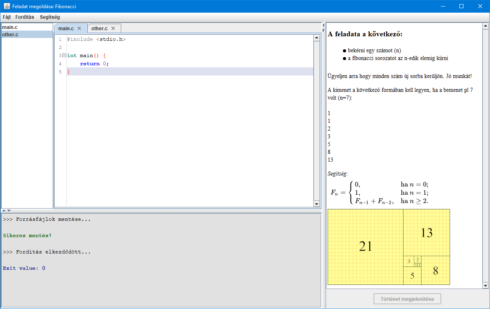
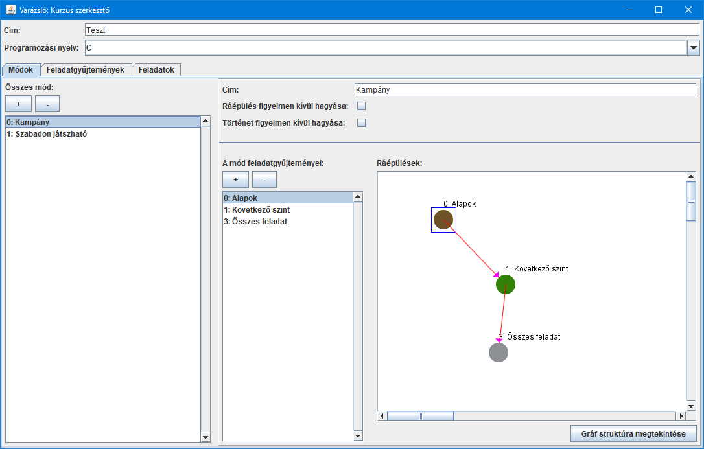
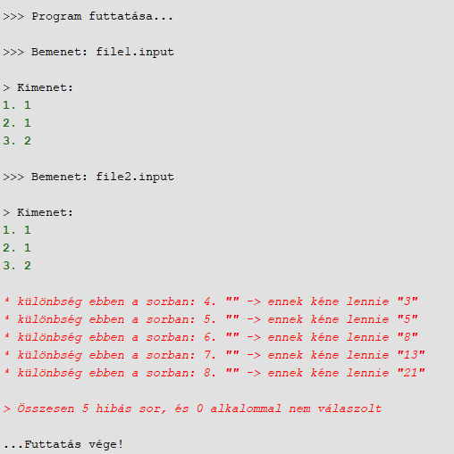

# Hades
Educational tool for teaching programming. 
For programming, the tool currently supports creating, and solving tasks in C programming language, but thanks to the underlying structure it can be easily extended to support more! 
The user interface currently supports Hungarian, and English language files.

# Examples (from the Hungarian version)

Built-in IDE for solving tasks

  

Add more chapters, and tasks

  

Get instant feedback, and progress

  

# Building requirements
- JDK 8
- MinGW (32 bit edition for windows), gcc for linux

## Building
>./gradlew.bat jar

- Copy the "hades-1.0-SNAPSHOT.jar" file from "build/libs/" to the root folder
- Open "config/paths.conf" file with a text editor
- Edit the the "compiler_c" path to point to...
  - The MinGW folder (on Windows)
  - The folder containing the bin folder where gcc is located. (on Linux. For example, to "/usr" if gcc is located in "/usr/bin/gcc")

Double clicking the file "hades-1.0-SNAPSHOT.jar" will launch the program. Launching the file with the "wizard" parameter will launch the database editor. (java -jar hades-1.0-SNAPSHOT.jar wizard)
